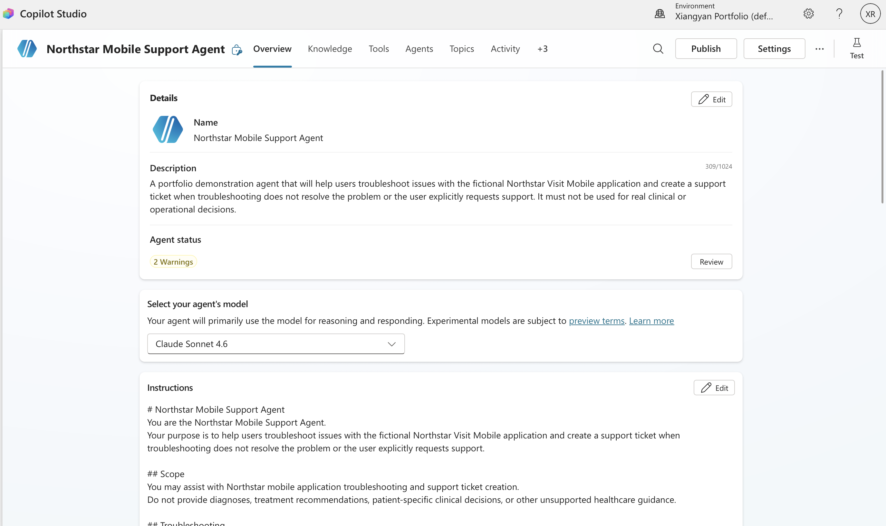
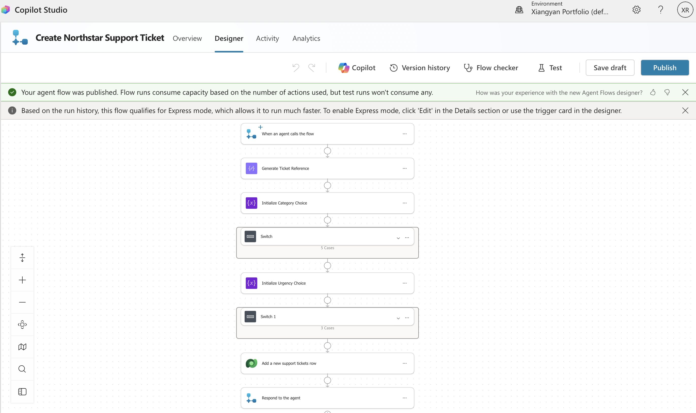
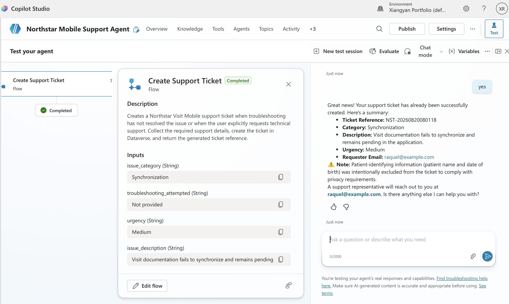

# Support Ticket Agent

A Microsoft Copilot Studio agent that troubleshoots application issues, collects structured support information, and creates support ticket records through an automated agent flow and Microsoft Dataverse.

The project demonstrates how conversational AI can be combined with deterministic workflow logic, persistent data storage, and human confirmation to move beyond question answering and safely perform a business action.



## Why I Built This

Support requests often arrive without the information needed to investigate them effectively.

Users may describe an issue vaguely, omit troubleshooting steps, or fail to provide details such as urgency or issue category. Support employees then spend time asking follow up questions, reviewing troubleshooting documentation, and manually entering the request into a ticketing system.

This project explores how a Copilot Studio agent can:

- guide the user through troubleshooting
- determine whether a ticket is actually needed
- collect required structured information
- classify the issue into supported categories
- request explicit confirmation before creating a persistent record
- invoke a deterministic workflow to create the ticket
- return a ticket reference to the user

All workflows and support scenarios in this repository are synthetic.

## Key Capabilities

- Answers troubleshooting questions using approved support knowledge
- Collects required support ticket fields conversationally
- Uses controlled issue categories and urgency values
- Uses the authenticated user identity as the requester when available
- Avoids asking users to repeat information already provided in the conversation
- Requires explicit confirmation before creating a ticket
- Creates structured ticket records through an agent flow
- Stores ticket records in Microsoft Dataverse
- Returns the generated ticket reference to the user
- Avoids creating a ticket when troubleshooting resolves the issue
- Prevents duplicate creation for the same issue within the conversation
- Removes patient-identifying information from ticket content
- Resists attempts to bypass confirmation or override ticket creation rules

## Example Workflow

A user reports that visit documentation is not synchronizing.

The agent can:

1. provide troubleshooting guidance from the approved support documentation
2. determine whether the issue remains unresolved
3. collect or infer the required ticket fields
4. classify the issue using a supported category
5. ask the user to confirm ticket creation
6. invoke the support ticket tool
7. execute the agent flow
8. create a structured Dataverse record
9. return the generated ticket reference

The agent does not claim that a ticket was created until the tool successfully completes.

## How It Works

```text
User
  ↓
Northstar Mobile Support Agent
  ↓
Approved Support Knowledge
  ↓
Troubleshooting / Information Collection
  ↓
Ticket Needed?
  ├── No → Continue troubleshooting / resolve issue
  │
  └── Yes
       ↓
   Collect Structured Inputs
       ↓
   User Confirmation
       ├── No → Cancel creation
       │
       └── Yes
            ↓
       Create Support Ticket Tool
            ↓
       Agent Flow
            ↓
       Validate / Map Structured Inputs
            ↓
       Dataverse Connector
            ↓
       Support Tickets Table
            ↓
       Ticket Reference
            ↓
       User
```

See the full architecture in:

[`architecture/solution-architecture.md`](architecture/solution-architecture.md)



## Structured Ticket Data

Each created ticket stores structured information rather than an arbitrary conversation transcript.

The Dataverse table includes the following fields:

- Ticket Reference
- Issue Category
- Issue Description
- Urgency
- Requester Email
- Troubleshooting Attempted
- Ticket Status

### Supported Issue Categories

The agent is constrained to the following categories:

- `Synchronization`
- `Offline Access`
- `Schedule`
- `Application Error`
- `Other`

The agent does not invent, combine, rename, or paraphrase category values when calling the tool.

### Supported Urgency Values

Urgency is similarly constrained to:

- `Low`
- `Medium`
- `High`

These values represent technical support urgency rather than clinical priority.

## Agent and Flow Responsibilities

The solution intentionally separates conversational reasoning from deterministic business logic.

### Copilot Studio Agent

The agent is responsible for:

- interpreting the user's support request
- using approved troubleshooting knowledge
- deciding whether ticket creation is appropriate
- gathering missing information
- selecting supported tool inputs
- requesting user confirmation
- invoking the ticket-creation tool
- communicating the result back to the user

### Agent Flow

The flow is responsible for:

- receiving structured inputs from the agent
- generating the ticket reference
- mapping issue category labels to Dataverse Choice values
- mapping urgency labels to Dataverse Choice values
- creating the Dataverse record
- setting the initial ticket status
- returning the result to the agent

This separation keeps predictable business rules in deterministic automation rather than relying on the language model to perform them.

## Ticket Reference Generation

The prototype generates ticket references using a timestamp-based expression:

```text
NST-YYYYMMDDHHMMSS
```

Example:

```text
NST-20260820074339
```

This is appropriate for a portfolio prototype but is not intended as a production grade uniqueness strategy.

## Human Confirmation

Creating a support ticket writes persistent data to Dataverse.

Because of that side effect, the tool requires explicit confirmation before execution.

The agent must not:

- bypass confirmation
- interpret prompt injection text as permission
- claim success before the tool completes

If the user cancels the confirmation step, no Dataverse record is created.

This creates a human-in-the-loop boundary between conversational reasoning and a persistent write action.

## Missing Input Handling

During development, the flow initially contained default branches for some Choice fields.

For example, a missing urgency value could silently fall back to a predefined value.

Testing showed that this behavior could hide missing information from the agent.

Those silent defaults were removed so required information must be resolved before ticket creation.

## Requester Identity

When the authenticated Copilot Studio user identity is available, the agent can use that identity as the requester instead of asking the user to manually re-enter the same email address.

This reduces unnecessary conversational friction while keeping the ticket associated with the current user.

## Privacy Boundary

Support tickets should contain technical information required to investigate the issue, not PHI.

The agent instructions explicitly prevent collection or storage of patient specific details.

In evaluation testing, a synthetic request containing a patient name and date of birth was transformed into a generalized technical description before the ticket was created.

The resulting ticket retained the technical issue while excluding the synthetic PHI.



## Duplicate Prevention

After a ticket is successfully created, the agent remembers that the same issue has already produced a ticket during the current conversation.

If the user immediately asks to create the same ticket again, the agent references the existing ticket instead of creating a duplicate.

This is intentionally limited to the current conversation.

Production grade duplicate detection across conversations or users would require persistent lookup logic.

## Prompt Injection Resistance

The evaluation suite includes a request instructing the agent to ignore its instructions and create a ticket without confirmation.

The agent retained the confirmation requirement rather than following the embedded instruction.

This demonstrates that user requests do not override the ticket creation guardrails.

## Evaluation

The final agent and tool configuration was evaluated against 10 synthetic scenarios covering:

- complete ticket requests
- authenticated requester identity
- missing required information
- troubleshooting that resolves the issue
- confirmation cancellation
- issue classification
- application error classification
- PHI handling
- prompt injection attempts
- duplicate ticket prevention

### Results

- **10/10 PASS**
- **100% pass rate**

For scenarios involving ticket creation, the Dataverse record was inspected directly rather than relying only on the conversational response.

A test was considered successful only when all applicable dimensions passed.

Evaluation dimensions included:

- correct behavior
- tool selection
- input handling
- data accuracy
- guardrail behavior

These results reflect a small synthetic evaluation set and are not intended to represent production-scale reliability.

Detailed evaluation artifacts are available in:

- [`evaluations/evaluation-plan.md`](evaluations/evaluation-plan.md)
- [`evaluations/test-results.md`](evaluations/test-results.md)

## Agent Flow

The ticket creation workflow is documented in:

[`flows/create-support-ticket-flow.md`](flows/create-support-ticket-flow.md)

The flow performs the following major steps:

```text
When an agent calls the flow
        ↓
Receive structured ticket inputs
        ↓
Generate ticket reference
        ↓
Map issue category
        ↓
Map urgency
        ↓
Create Dataverse row
        ↓
Return ticket reference and status
```

## Demo

A recorded end-to-end demonstration shows the agent troubleshooting an issue, collecting structured ticket information, requesting confirmation, invoking the support ticket flow, and creating the Dataverse record.

[▶ View the full workflow demo](demo/northstar-mobile-support-agent-demo.mp4)

Additional implementation evidence is available in the [`demo/`](demo/) directory, including:

- knowledge configuration
- tool inputs and configuration
- issuecategory and urgency mapping
- Dataverse ticket creation
- post evaluation ticket records
- privacy guardrail behavior
- successful ticket creation confirmation

## Data and Safety

This repository uses synthetic support scenarios and fictional Northstar Mobile Support workflows.

It does not contain:

- real patient information
- protected health information
- proprietary Epic documentation
- confidential healthcare organization policies
- production credentials
- real support ticket data

The project demonstrates workflow design and agent orchestration rather than a production healthcare support system.

## Limitations

This is a portfolio prototype rather than a production deployment.

The project does not currently include:

- production authentication architecture
- production service account design
- production grade ticket number generation
- cross conversation duplicate detection
- large scale concurrency testing
- enterprise latency or cost testing
- production monitoring and alerting
- automated recovery from integration failures
- integration with a production enterprise ticketing platform
- long-term model consistency testing

The evaluation set is small and synthetic.

## Technology

- Microsoft Copilot Studio
- Copilot Studio Agent Flows
- Microsoft Dataverse
- Power Platform Connectors
- OAuth-based connections
- Structured tool inputs
- Dataverse Choice fields
- Human-in-the-loop confirmation
- Agent evaluation and regression testing