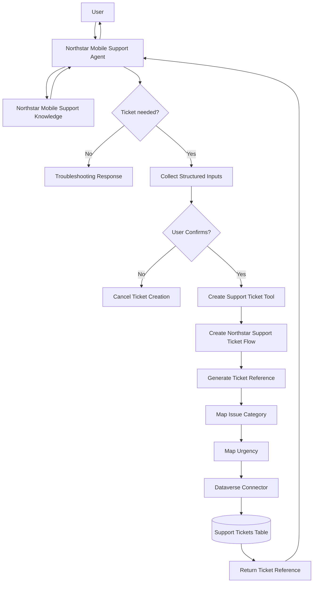

# Solution Architecture

The Northstar Mobile Support Agent combines conversational AI, grounded troubleshooting knowledge, tool orchestration, a deterministic agent flow, and persistent Dataverse storage.

